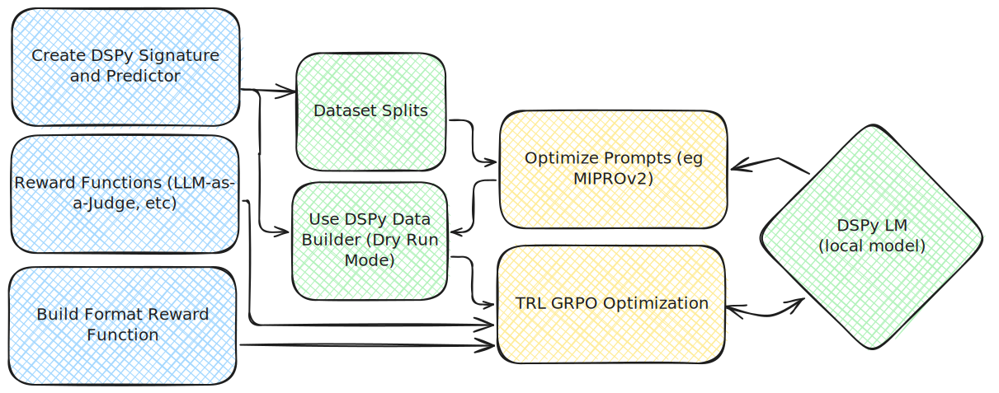

# DSPy Data: Training Utilities for DSPy Programs

A utility library for training language models with DSPy programs using reinforcement learning workflows like GRPO, SFT, and DPO.

## Table of Contents

- [Overview](#overview)
- [Installation](#installation)
- [Core Components](#core-components)
  - [Data Builder](#data-builder)
  - [Format Reward Functions](#format-reward-functions)
- [GRPO Training Workflow](#grpo-training-workflow)
- [Usage Examples](#usage-examples)
  - [Basic Data Collection](#basic-data-collection)
  - [Format Reward Functions](#format-reward-functions-1)
  - [Complete GRPO Workflow](#complete-grpo-workflow)
- [API Reference](#api-reference)

## Overview

DSPy Data provides utilities to bridge DSPy program optimization with language model training. The library enables you to:

- **Generate training datasets** from DSPy programs with comprehensive trace logging
- **Create format reward functions** that enforce structured output compliance
- **Implement training workflows** like GRPO for task-specific model improvement
- **Combine prompt optimization with model training** for enhanced performance

## Installation

```bash
pip install dspy-data
```

## Core Components

### Data Builder

The `Collect` module generates training datasets by running DSPy programs and saving the inputs, outputs, traces, and rewards:

```python
import dspy_data

# Create a data collector
collect = dspy_data.Collect(
    predictor=your_dspy_module,
    output_dir="./training_data",
    reward_fn=your_reward_function, # optional: for saving score
    num_threads=8
)

# Generate dataset (saves prompts, inputs, responses to output_dir)
collect(examples, n=5)  # 5 responses per example
```

Features:
- **Parallel execution** for efficient data generation
- **Complete trace logging** of LM interactions
- **Reward scoring** for each generated example
- **Dry run mode** for prompt formatting without LM calls

### Format Reward Functions

Create reward functions that validate structured output compliance:

```python
from dspy_data import build_format_reward
import dspy

# Define your DSPy signature
signature = dspy.Signature("question -> answer: str, confidence: float")

# Build format reward function
format_reward = build_format_reward(signature, dspy.adapters.JSONAdapter())

# Use in training
reward = format_reward('{"answer": "Paris", "confidence": 0.95}')  # Returns 1.0
reward = format_reward('invalid json')  # Returns 0.0
```

## GRPO Training Workflow



The GRPO (Generalized Reward-based Policy Optimization) workflow combines DSPy's prompt optimization with reinforcement learning-based model training:

### Workflow Steps

1. **Create DSPy Signature and Predictor**
   - Define your task signature with input/output fields
   - Create a DSPy predictor module

2. **Build Reward Functions**
   - Create task-specific evaluation functions
   - Build format reward functions for structured output compliance

3. **Optimize Prompts**
   - Use DSPy optimizers (MIPROv2, etc.) to find optimal prompts
   - Evaluate using your reward functions on validation data

4. **Generate Training Data**
   - Load optimized DSPy program
   - Use dry run mode to generate formatted training examples
   - Apply format rewards to ensure output compliance

5. **GRPO Training**
   - Combine format rewards with evaluation rewards
   - Train local model using GRPO with the optimized prompts
   - Model learns both task performance and output formatting

6. **Deploy Optimized Model**
   - Load trained model with optimized DSPy program
   - Achieve improved performance on your specific task

## Usage Examples

### Basic Data Collection

```python
import dspy
import dspy_data

# Define a simple QA signature
signature = dspy.Signature("question: str -> answer: str, confidence: float")
predictor = dspy.Predict(signature)

# Create collector
collect = dspy_data.Collect(
    predictor=predictor,
    output_dir="./qa_dataset",
    reward_fn=... # scoring, eval
)

# Generate training data
examples = [
    {"question": "What is the capital of France?"},
    {"question": "Explain quantum computing"},
]

_ = collect(examples, n=3)  # 3 responses per question
```

### Format Reward Functions

```python
from dspy_data import build_format_reward
import dspy

# Create signature for structured output
signature = dspy.Signature(
    "question, context -> answer: str, confidence: float, sources: list[str]"
)

# Test different adapters
chat_reward = build_format_reward(signature, dspy.adapters.ChatAdapter())
json_reward = build_format_reward(signature, dspy.adapters.JSONAdapter())

# Valid ChatAdapter format
chat_response = """
[[ ## answer ## ]]
The capital is Paris

[[ ## confidence ## ]]
0.95

[[ ## sources ## ]]
["Encyclopedia Britannica", "World Atlas"]
"""

print(chat_reward(chat_response))  # 1.0

# Valid JSON format
json_response = {
    "answer": "The capital is Paris",
    "confidence": 0.95,
    "sources": ["Encyclopedia Britannica", "World Atlas"]
}

print(json_reward(json.dumps(json_response)))  # 1.0
```

### Complete GRPO Workflow

```python
import dspy
from dspy_data import Collect, build_format_reward

# 1. Define signature and predictor
signature = dspy.Signature("question: str -> answer: str, confidence: float")
predictor = dspy.Predict(signature)

# 2. Create reward functions
def task_reward(inputs, outputs):
    # Your task-specific evaluation logic
    return 1.0 if "correct answer" in outputs.answer.lower() else 0.0

format_reward = build_format_reward(signature, dspy.adapters.JSONAdapter())

# 3. Optimize prompts with DSPy
optimizer = dspy.MIPROv2(
    metric=lambda example, pred, _: task_reward(example, pred),
    num_candidates=10,
    init_temperature=1.0
)

# Assume you have train/val datasets, standard DSPy optimization
optimized_program = optimizer.compile(predictor, trainset=train_data, valset=val_data)

# 4. Now save the optimizaed prompts for GRPO training
collect = Collect(
    predictor=optimized_program,
    output_dir="./grpo_training_data",
)

# Use dry run to generate formatted examples for GRPO
training_examples = collect(train_data, n=1, dry_run=True)

# 5. GRPO Training (using your GRPO implementation)
def combined_reward(response_text):
    # Combine format compliance with task performance
    format_score = format_reward(response_text)
    # ... additional task evaluation logic
    return format_score * task_performance_score

# Train your model with GRPO using combined_reward
# grpo_trainer.train(model, training_examples, reward_fn=combined_reward)

# 6. Load trained model with optimized program for inference
# trained_model = load_your_trained_model()
# dspy.settings.configure(lm=trained_model)
# final_predictor = optimized_program
```

## API Reference

### `Collect`

```python
class Collect(dspy.Module):
    def __init__(self, predictor, output_dir, reward_fn=None, num_threads=8):
        """
        Args:
            predictor: DSPy module to run
            output_dir: Directory to save JSON training files
            reward_fn: Function(inputs, outputs) -> float
            num_threads: Parallel execution threads
        """

    def forward(self, examples, n=1, *, dry_run=False):
        """
        Args:
            examples: List of input examples or single example dict
            n: Number of responses to generate per example
            dry_run: Use DryRunLM for prompt formatting without API calls

        Returns:
            List of predictions
        """
```

### `build_format_reward`

```python
def build_format_reward(signature: dspy.Signature, adapter: Adapter = None):
    """
    Creates a reward function that validates structured output format.

    Args:
        signature: DSPy signature defining expected output fields
        adapter: DSPy adapter (ChatAdapter, JSONAdapter, etc.)

    Returns:
        Function that takes response text and returns 1.0 if valid format, 0.0 otherwise
    """
```

The generated training files contain:
- `inputs`: Original example inputs
- `trace`: Complete LM interaction history
- `output`: Structured prediction outputs
- `reward`: Computed reward score
